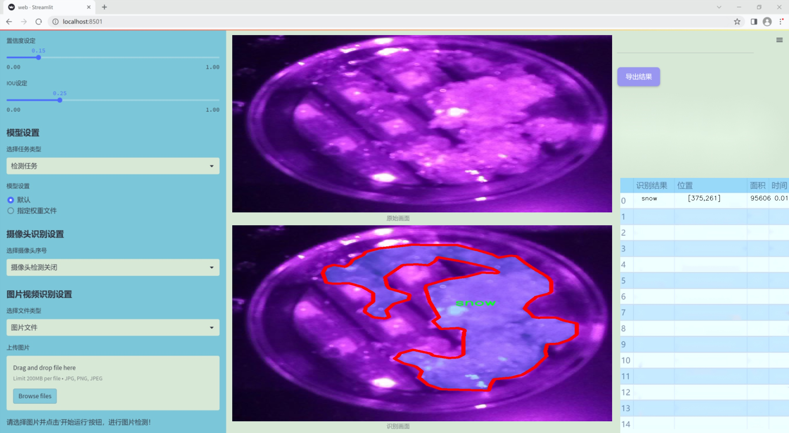
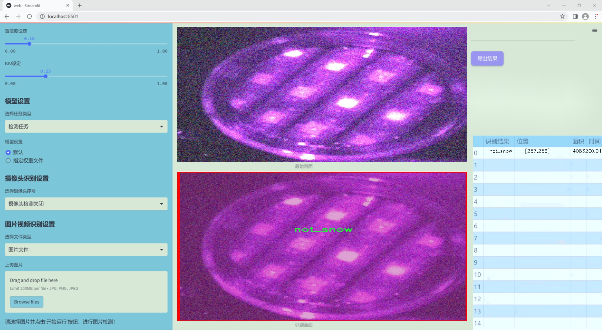
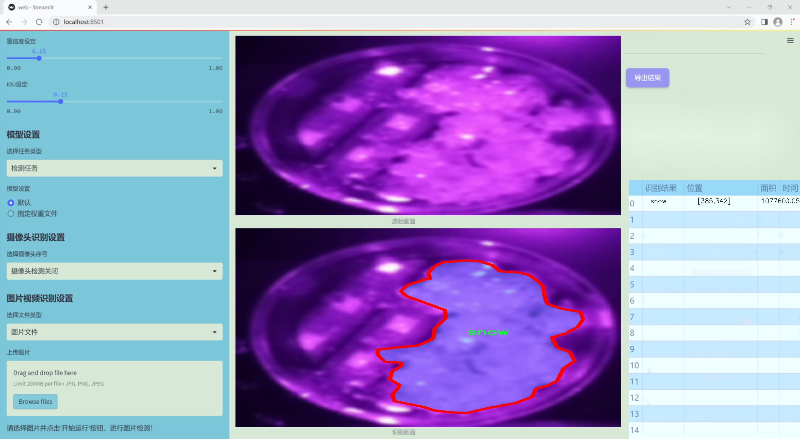
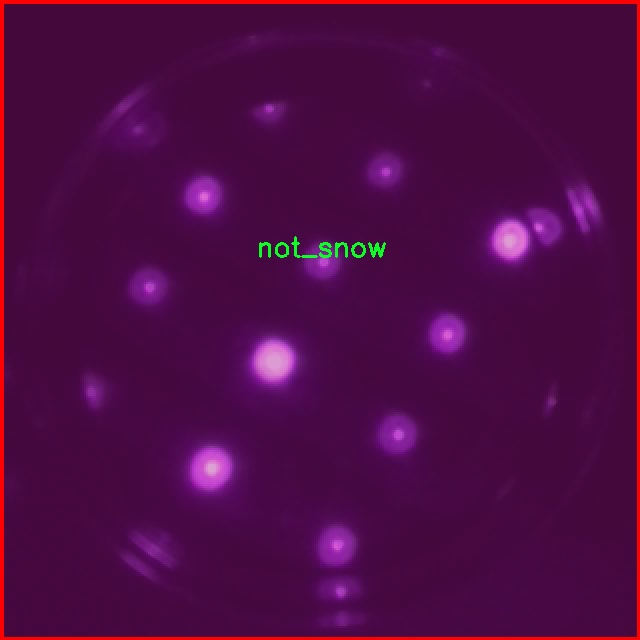
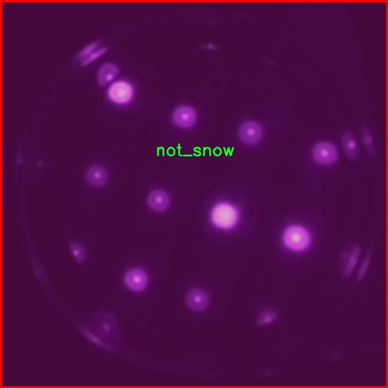
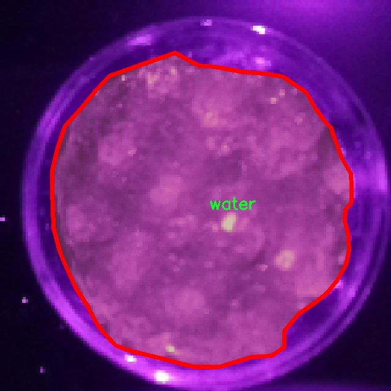
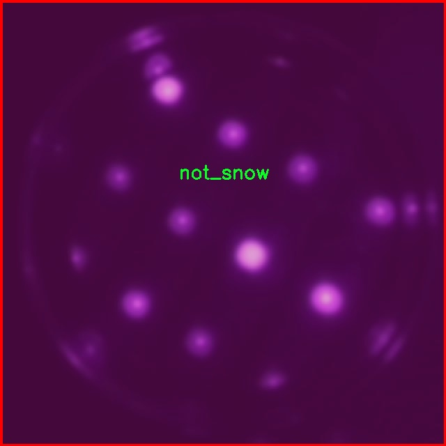
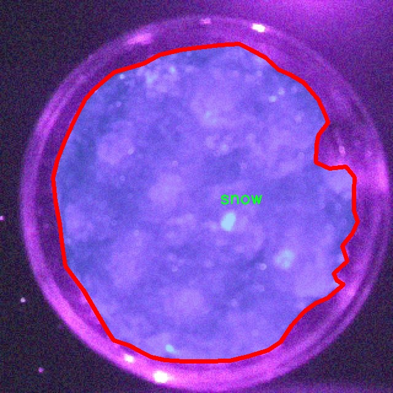

### 1.背景意义

研究背景与意义

随着全球气候变化的加剧，雪水融化的状态对水资源管理、农业生产和生态环境的影响日益显著。雪水融化不仅影响水库的蓄水量，还对河流的流量、土壤湿度以及植物生长周期产生深远影响。因此，准确识别和监测雪水融化状态显得尤为重要。传统的雪水融化状态监测方法往往依赖于人工观测和经验判断，效率低下且容易受到主观因素的影响。随着计算机视觉技术的快速发展，基于深度学习的图像分割方法为雪水融化状态的自动识别提供了新的解决方案。

本研究旨在基于改进的YOLOv11模型，构建一个高效的雪水融化状态识别图像分割系统。该系统将利用一个包含1500张图像的数据集，数据集中包含三类标注：无雪、雪和水。这些类别的细致划分将有助于系统更准确地识别不同的雪水状态，从而为后续的水资源管理和生态监测提供数据支持。通过引入实例分割技术，系统不仅能够识别出雪水的存在与否，还能对其进行精确的区域划分，为后续的分析和决策提供更为详尽的信息。

此外，改进的YOLOv11模型在处理速度和准确性上具有显著优势，能够在实时监测中发挥重要作用。通过对数据集的有效利用和模型的优化，本研究期望在雪水融化状态识别领域取得突破，为相关领域的研究和应用提供新的思路和方法。这一研究不仅具有重要的学术价值，还有助于推动气候变化背景下的环境保护和可持续发展。

### 2.视频效果

[2.1 视频效果](https://www.bilibili.com/video/BV12tkgYXEf5/)

### 3.图片效果







##### [项目涉及的源码数据来源链接](https://kdocs.cn/l/cszuIiCKVNis)**

注意：本项目提供训练的数据集和训练教程,由于版本持续更新,暂不提供权重文件（best.pt）,请按照6.训练教程进行训练后实现上图演示的效果。

### 4.数据集信息

##### 4.1 本项目数据集类别数＆类别名

nc: 3
names: ['not_snow', 'snow', 'water']


该项目为【图像分割】数据集，请在【训练教程和Web端加载模型教程（第三步）】这一步的时候按照【图像分割】部分的教程来训练

##### 4.2 本项目数据集信息介绍

本项目数据集信息介绍

本项目旨在开发一个改进的YOLOv11模型，以实现雪水融化状态的精准识别与图像分割。为此，我们构建了一个专门的数据集，命名为“pre-examination-seg”，该数据集涵盖了三种主要类别，分别为“not_snow”（非雪）、“snow”（雪）和“water”（水）。这些类别的选择是基于雪水融化过程中的不同状态，能够有效反映环境变化对水体和雪的影响。

数据集中包含了大量高质量的图像，涵盖了不同的场景和光照条件，以确保模型在各种环境下的鲁棒性和准确性。每一类图像都经过精心标注，确保在训练过程中，模型能够学习到每种状态的特征和边界。这种多样性不仅增强了模型的泛化能力，还为后续的实际应用提供了坚实的基础。

在数据预处理阶段，我们对图像进行了标准化处理，以提高模型的训练效率。同时，针对不同类别的图像，我们采用了数据增强技术，包括旋转、缩放和翻转等，以进一步丰富数据集，减少过拟合的风险。通过这些措施，我们力求构建一个全面且具代表性的数据集，以支持YOLOv11模型在雪水融化状态识别中的表现。

此外，数据集的设计也考虑到了实际应用场景中的复杂性。例如，在城市环境中，雪和水的分布可能受到人类活动的影响，因此我们确保数据集中包含了城市与自然环境的多样化图像。这种设计不仅有助于提高模型的识别精度，也为未来的研究提供了广阔的探索空间。通过本项目的数据集，我们希望能够推动雪水融化状态识别技术的发展，为相关领域的研究与应用提供有力支持。











### 5.全套项目环境部署视频教程（零基础手把手教学）

[5.1 所需软件PyCharm和Anaconda安装教程（第一步）](https://www.bilibili.com/video/BV1BoC1YCEKi/?spm_id_from=333.999.0.0&vd_source=bc9aec86d164b67a7004b996143742dc)


[5.2 安装Python虚拟环境创建和依赖库安装视频教程（第二步）](https://www.bilibili.com/video/BV1ZoC1YCEBw?spm_id_from=333.788.videopod.sections&vd_source=bc9aec86d164b67a7004b996143742dc)

### 6.改进YOLOv11训练教程和Web_UI前端加载模型教程（零基础手把手教学）

[6.1 改进YOLOv11训练教程和Web_UI前端加载模型教程（第三步）](https://www.bilibili.com/video/BV1BoC1YCEhR?spm_id_from=333.788.videopod.sections&vd_source=bc9aec86d164b67a7004b996143742dc)


按照上面的训练视频教程链接加载项目提供的数据集，运行train.py即可开始训练



     Epoch   gpu_mem       box       obj       cls    labels  img_size
     1/200     20.8G   0.01576   0.01955  0.007536        22      1280: 100%|██████████| 849/849 [14:42<00:00,  1.04s/it]
               Class     Images     Labels          P          R     mAP@.5 mAP@.5:.95: 100%|██████████| 213/213 [01:14<00:00,  2.87it/s]
                 all       3395      17314      0.994      0.957      0.0957      0.0843

     Epoch   gpu_mem       box       obj       cls    labels  img_size
     2/200     20.8G   0.01578   0.01923  0.007006        22      1280: 100%|██████████| 849/849 [14:44<00:00,  1.04s/it]
               Class     Images     Labels          P          R     mAP@.5 mAP@.5:.95: 100%|██████████| 213/213 [01:12<00:00,  2.95it/s]
                 all       3395      17314      0.996      0.956      0.0957      0.0845

     Epoch   gpu_mem       box       obj       cls    labels  img_size
     3/200     20.8G   0.01561    0.0191  0.006895        27      1280: 100%|██████████| 849/849 [10:56<00:00,  1.29it/s]
               Class     Images     Labels          P          R     mAP@.5 mAP@.5:.95: 100%|███████   | 187/213 [00:52<00:00,  4.04it/s]
                 all       3395      17314      0.996      0.957      0.0957      0.0845


###### [项目数据集下载链接](https://kdocs.cn/l/cszuIiCKVNis)

### 7.原始YOLOv11算法讲解

YOLO11采用改进的骨干和颈部架构，增强了特征提取能力，提高了物体检测的精确度和复杂任务的表现。YOLO11引入精炼的架构设计和优化的训练流程，实现更快的处理速度，同时保持精度和性能之间的最佳平衡。通过模型设计的进步，YOLO11m在COCO数据集上实现了更高的均值平均精度（mAP），同时使用比YOLOv8m少22%的参数，使其在不妥协准确性的情况下更加计算高效。YOLO11可以无缝部署在各种环境中，包括边缘设备、云平台以及支持NVIDIA
GPU的系统，确保最大灵活性。无论是物体检测、实例分割、图像分类、姿态估计，还是定向物体检测（OBB），YOLO11都旨在应对多样的计算机视觉挑战。


##### **Ultralytics YOLO11相比于之前版本的主要改进有哪些？**

Ultralytics YOLO11在其前身基础上引入了几项重要进步。主要改进包括：

  1. **增强的特征提取** ：YOLO11采用改进的骨干和颈部架构，增强了特征提取能力，提高了物体检测的精确度。
  2.  **优化的效率和速度** ：精炼的架构设计和优化的训练流程实现了更快的处理速度，同时保持了准确性和性能之间的平衡。
  3.  **更高的准确性与更少的参数** ：YOLO11m在COCO数据集上实现了更高的均值平均精度（mAP），同时使用比YOLOv8m少22%的参数，使其在不妥协准确性的情况下更加计算高效。
  4.  **环境适应性强** ：YOLO11可以在多种环境中部署，包括边缘设备、云平台以及支持NVIDIA GPU的系统。
  5.  **支持广泛的任务** ：YOLO11支持多种计算机视觉任务，如物体检测、实例分割、图像分类、姿态估计和定向物体检测（OBB）。

我们先来看一下其网络结构有什么变化，可以看出，相比较于YOLOv8模型，其将CF2模块改成C3K2，同时在SPPF模块后面添加了一个C2PSA模块，且将YOLOv10的head思想引入到YOLO11的head中，使用深度可分离的方法，减少冗余计算，提高效率。下面我们来详细看一下这两个模块的结构是怎么构成的，以及它们为什么要这样设计


##### C3K2的网络结构

从下面图中我们可以看到，C3K2模块其实就是C2F模块转变出来的，它代码中有一个设置，就是当c3k这个参数为FALSE的时候，C3K2模块就是C2F模块，也就是说它的Bottleneck是普通的Bottleneck；反之当它为true的时候，将Bottleneck模块替换成C3模块。


##### C2PSA的网络结构

` `C2PSA是对 `C2f` 模块的扩展，它结合了PSA(Pointwise Spatial
Attention)块，用于增强特征提取和注意力机制。通过在标准 `C2f` 模块中引入 PSA
块，C2PSA实现了更强大的注意力机制，从而提高了模型对重要特征的捕捉能力。


##### **C2f 模块回顾：**

**** C2f模块是一个更快的 CSP（Cross Stage Partial）瓶颈实现，它通过两个卷积层和多个 Bottleneck
块进行特征提取。相比传统的 CSPNet，C2f 优化了瓶颈层的结构，使得计算速度更快。在 C2f中，`cv1` 是第一个 1x1
卷积，用于减少通道数；`cv2` 是另一个 1x1 卷积，用于恢复输出通道数。而 `n` 是一个包含 Bottleneck 块的数量，用于提取特征。

##### **C2PSA 模块的增强** ：

**C2PSA** 扩展了 C2f，通过引入PSA( **Position-Sensitive Attention)**
，旨在通过多头注意力机制和前馈神经网络来增强特征提取能力。它可以选择性地添加残差结构（shortcut）以优化梯度传播和网络训练效果。同时，使用FFN
可以将输入特征映射到更高维的空间，捕获输入特征的复杂非线性关系，允许模型学习更丰富的特征表示。

##### head部分

YOLO11在head部分的cls分支上使用深度可分离卷积 ，具体代码如下，cv2边界框回归分支，cv3分类分支。

    
    
     self.cv2 = nn.ModuleList(
                nn.Sequential(Conv(x, c2, 3), Conv(c2, c2, 3), nn.Conv2d(c2, 4 * self.reg_max, 1)) for x in ch
            )
            self.cv3 = nn.ModuleList(
                nn.Sequential(
                    nn.Sequential(DWConv(x, x, 3), Conv(x, c3, 1)),
                    nn.Sequential(DWConv(c3, c3, 3), Conv(c3, c3, 1)),
                    nn.Conv2d(c3, self.nc, 1),
                )
                for x in ch
            )


### 8.200+种全套改进YOLOV11创新点原理讲解

#### 8.1 200+种全套改进YOLOV11创新点原理讲解大全

由于篇幅限制，每个创新点的具体原理讲解就不全部展开，具体见下列网址中的改进模块对应项目的技术原理博客网址【Blog】（创新点均为模块化搭建，原理适配YOLOv5~YOLOv11等各种版本）

[改进模块技术原理博客【Blog】网址链接](https://gitee.com/qunmasj/good)


#### 8.2 精选部分改进YOLOV11创新点原理讲解

###### 这里节选部分改进创新点展开原理讲解(完整的改进原理见上图和[改进模块技术原理博客链接](https://gitee.com/qunmasj/good)【如果此小节的图加载失败可以通过CSDN或者Github搜索该博客的标题访问原始博客，原始博客图片显示正常】


#### 特征融合

模型架构图如下

  Darknet-53的特点可以这样概括：（Conv卷积模块+Residual Block残差块）串行叠加4次

  Conv卷积层+Residual Block残差网络就被称为一个stage


上面红色指出的那个，原始的Darknet-53里面有一层 卷积，在YOLOv11里面，把一层卷积移除了

为什么移除呢？

        原始Darknet-53模型中间加的这个卷积层做了什么？滤波器（卷积核）的个数从 上一个卷积层的512个，先增加到1024个卷积核，然后下一层卷积的卷积核的个数又降低到512个

        移除掉这一层以后，少了1024个卷积核，就可以少做1024次卷积运算，同时也少了1024个3×3的卷积核的参数，也就是少了9×1024个参数需要拟合。这样可以大大减少了模型的参数，（相当于做了轻量化吧）

        移除掉这个卷积层，可能是因为作者发现移除掉这个卷积层以后，模型的score有所提升，所以才移除掉的。为什么移除掉以后，分数有所提高呢？可能是因为多了这些参数就容易，参数过多导致模型在训练集删过拟合，但是在测试集上表现很差，最终模型的分数比较低。你移除掉这个卷积层以后，参数减少了，过拟合现象不那么严重了，泛化能力增强了。当然这个是，拿着你做实验的结论，反过来再找补，再去强行解释这种现象的合理性。


通过MMdetection官方绘制册这个图我们可以看到，进来的这张图片经过一个“Feature Pyramid Network(简称FPN)”，然后最后的P3、P4、P5传递给下一层的Neck和Head去做识别任务。 PAN（Path Aggregation Network）


“FPN是自顶向下，将高层的强语义特征传递下来。PAN就是在FPN的后面添加一个自底向上的金字塔，对FPN补充，将低层的强定位特征传递上去，

FPN是自顶（小尺寸，卷积次数多得到的结果，语义信息丰富）向下（大尺寸，卷积次数少得到的结果），将高层的强语义特征传递下来，对整个金字塔进行增强，不过只增强了语义信息，对定位信息没有传递。PAN就是针对这一点，在FPN的后面添加一个自底（卷积次数少，大尺寸）向上（卷积次数多，小尺寸，语义信息丰富）的金字塔，对FPN补充，将低层的强定位特征传递上去，又被称之为“双塔战术”。

FPN层自顶向下传达强语义特征，而特征金字塔则自底向上传达强定位特征，两两联手，从不同的主干层对不同的检测层进行参数聚合,这样的操作确实很皮。
#### 自底向上增强


而 PAN（Path Aggregation Network）是对 FPN 的一种改进，它的设计理念是在 FPN 后面添加一个自底向上的金字塔。PAN 引入了路径聚合的方式，通过将浅层特征图（低分辨率但语义信息较弱）和深层特征图（高分辨率但语义信息丰富）进行聚合，并沿着特定的路径传递特征信息，将低层的强定位特征传递上去。这样的操作能够进一步增强多尺度特征的表达能力，使得 PAN 在目标检测任务中表现更加优秀。


### Gold-YOLO简介
YOLO系列模型面世至今已有8年，由于其优异的性能，已成为目标检测领域的标杆。在系列模型经过十多个不同版本的改进发展逐渐稳定完善的今天，研究人员更多关注于单个计算模块内结构的精细调整，或是head部分和训练方法上的改进。但这并不意味着现有模式已是最优解。

当前YOLO系列模型通常采用类FPN方法进行信息融合，而这一结构在融合跨层信息时存在信息损失的问题。针对这一问题，我们提出了全新的信息聚集-分发（Gather-and-Distribute Mechanism）GD机制，通过在全局视野上对不同层级的特征进行统一的聚集融合并分发注入到不同层级中，构建更加充分高效的信息交互融合机制，并基于GD机制构建了Gold-YOLO。在COCO数据集中，我们的Gold-YOLO超越了现有的YOLO系列，实现了精度-速度曲线上的SOTA。


精度和速度曲线（TensorRT7）


精度和速度曲线（TensorRT8）
传统YOLO的问题
在检测模型中，通常先经过backbone提取得到一系列不同层级的特征，FPN利用了backbone的这一特点，构建了相应的融合结构：不层级的特征包含着不同大小物体的位置信息，虽然这些特征包含的信息不同，但这些特征在相互融合后能够互相弥补彼此缺失的信息，增强每一层级信息的丰富程度，提升网络性能。

原始的FPN结构由于其层层递进的信息融合模式，使得相邻层的信息能够充分融合，但也导致了跨层信息融合存在问题：当跨层的信息进行交互融合时，由于没有直连的交互通路，只能依靠中间层充当“中介”进行融合，导致了一定的信息损失。之前的许多工作中都关注到了这一问题，而解决方案通常是通过添加shortcut增加更多的路径，以增强信息流动。

然而传统的FPN结构即便改进后，由于网络中路径过多，且交互方式不直接，基于FPN思想的信息融合结构仍然存在跨层信息交互困难和信息损失的问题。

#### Gold-YOLO：全新的信息融合交互机制


#### Gold-YOLO架构
参考该博客提出的一种全新的信息交互融合机制：信息聚集-分发机制(Gather-and-Distribute Mechanism)。该机制通过在全局上融合不同层次的特征得到全局信息，并将全局信息注入到不同层级的特征中，实现了高效的信息交互和融合。在不显著增加延迟的情况下GD机制显著增强了Neck部分的信息融合能力，提高了模型对不同大小物体的检测能力。

GD机制通过三个模块实现：信息对齐模块(FAM)、信息融合模块(IFM)和信息注入模块(Inject)。

信息对齐模块负责收集并对齐不同层级不同大小的特征

信息融合模块通过使用卷积或Transformer算子对对齐后的的特征进行融合，得到全局信息

信息注入模块将全局信息注入到不同层级中

在Gold-YOLO中，针对模型需要检测不同大小的物体的需要，并权衡精度和速度，我们构建了两个GD分支对信息进行融合：低层级信息聚集-分发分支(Low-GD)和高层级信息聚集-分发分支(High-GD)，分别基于卷积和transformer提取和融合特征信息。

此外,为了促进局部信息的流动，我们借鉴现有工作，构建了一个轻量级的邻接层融合模块，该模块在局部尺度上结合了邻近层的特征，进一步提升了模型性能。我们还引入并验证了预训练方法对YOLO模型的有效性，通过在ImageNet 1K上使用MAE方法对主干进行预训练，显著提高了模型的收敛速度和精度。


### 9.系统功能展示

图9.1.系统支持检测结果表格显示

  图9.2.系统支持置信度和IOU阈值手动调节

  图9.3.系统支持自定义加载权重文件best.pt(需要你通过步骤5中训练获得)

  图9.4.系统支持摄像头实时识别

  图9.5.系统支持图片识别

  图9.6.系统支持视频识别

  图9.7.系统支持识别结果文件自动保存

  图9.8.系统支持Excel导出检测结果数据


### 10. YOLOv11核心改进源码讲解

#### 10.1 VanillaNet.py

以下是对给定代码的核心部分进行提炼和详细注释的结果：

```python
import torch
import torch.nn as nn
import torch.nn.functional as F
from timm.layers import weight_init

# 定义激活函数类，继承自ReLU
class Activation(nn.ReLU):
    def __init__(self, dim, act_num=3, deploy=False):
        super(Activation, self).__init__()
        self.deploy = deploy  # 是否处于部署模式
        # 初始化权重和偏置
        self.weight = torch.nn.Parameter(torch.randn(dim, 1, act_num * 2 + 1, act_num * 2 + 1))
        self.bias = None
        self.bn = nn.BatchNorm2d(dim, eps=1e-6)  # 批归一化
        self.dim = dim
        self.act_num = act_num
        weight_init.trunc_normal_(self.weight, std=.02)  # 权重初始化

    def forward(self, x):
        # 前向传播
        if self.deploy:
            return F.conv2d(
                super(Activation, self).forward(x), 
                self.weight, self.bias, padding=(self.act_num * 2 + 1) // 2, groups=self.dim)
        else:
            return self.bn(F.conv2d(
                super(Activation, self).forward(x),
                self.weight, padding=self.act_num, groups=self.dim))

    def switch_to_deploy(self):
        # 切换到部署模式，融合批归一化
        if not self.deploy:
            kernel, bias = self._fuse_bn_tensor(self.weight, self.bn)
            self.weight.data = kernel
            self.bias = torch.nn.Parameter(torch.zeros(self.dim))
            self.bias.data = bias
            self.__delattr__('bn')  # 删除bn属性
            self.deploy = True

    def _fuse_bn_tensor(self, weight, bn):
        # 融合权重和批归一化参数
        kernel = weight
        running_mean = bn.running_mean
        running_var = bn.running_var
        gamma = bn.weight
        beta = bn.bias
        eps = bn.eps
        std = (running_var + eps).sqrt()
        t = (gamma / std).reshape(-1, 1, 1, 1)
        return kernel * t, beta + (0 - running_mean) * gamma / std

# 定义基本块
class Block(nn.Module):
    def __init__(self, dim, dim_out, act_num=3, stride=2, deploy=False):
        super().__init__()
        self.deploy = deploy
        # 根据是否部署选择不同的卷积层
        if self.deploy:
            self.conv = nn.Conv2d(dim, dim_out, kernel_size=1)
        else:
            self.conv1 = nn.Sequential(
                nn.Conv2d(dim, dim, kernel_size=1),
                nn.BatchNorm2d(dim, eps=1e-6),
            )
            self.conv2 = nn.Sequential(
                nn.Conv2d(dim, dim_out, kernel_size=1),
                nn.BatchNorm2d(dim_out, eps=1e-6)
            )
        # 池化层
        self.pool = nn.MaxPool2d(stride) if stride != 1 else nn.Identity()
        self.act = Activation(dim_out, act_num)  # 激活函数

    def forward(self, x):
        # 前向传播
        if self.deploy:
            x = self.conv(x)
        else:
            x = self.conv1(x)
            x = F.leaky_relu(x, negative_slope=1)  # 使用Leaky ReLU
            x = self.conv2(x)

        x = self.pool(x)  # 池化
        x = self.act(x)   # 激活
        return x

    def switch_to_deploy(self):
        # 切换到部署模式
        if not self.deploy:
            # 融合卷积和批归一化
            kernel, bias = self._fuse_bn_tensor(self.conv1[0], self.conv1[1])
            self.conv = self.conv2[0]  # 选择卷积层
            self.conv.weight.data = kernel
            self.conv.bias.data = bias
            self.__delattr__('conv1')
            self.__delattr__('conv2')
            self.act.switch_to_deploy()  # 切换激活函数
            self.deploy = True

# 定义VanillaNet模型
class VanillaNet(nn.Module):
    def __init__(self, in_chans=3, num_classes=1000, dims=[96, 192, 384, 768], 
                 drop_rate=0, act_num=3, strides=[2, 2, 2, 1], deploy=False):
        super().__init__()
        self.deploy = deploy
        # 定义stem部分
        if self.deploy:
            self.stem = nn.Sequential(
                nn.Conv2d(in_chans, dims[0], kernel_size=4, stride=4),
                Activation(dims[0], act_num)
            )
        else:
            self.stem1 = nn.Sequential(
                nn.Conv2d(in_chans, dims[0], kernel_size=4, stride=4),
                nn.BatchNorm2d(dims[0], eps=1e-6),
            )
            self.stem2 = nn.Sequential(
                nn.Conv2d(dims[0], dims[0], kernel_size=1, stride=1),
                nn.BatchNorm2d(dims[0], eps=1e-6),
                Activation(dims[0], act_num)
            )

        self.stages = nn.ModuleList()
        for i in range(len(strides)):
            stage = Block(dim=dims[i], dim_out=dims[i + 1], act_num=act_num, stride=strides[i], deploy=deploy)
            self.stages.append(stage)  # 添加每个阶段的Block

    def forward(self, x):
        # 前向传播
        if self.deploy:
            x = self.stem(x)
        else:
            x = self.stem1(x)
            x = F.leaky_relu(x, negative_slope=1)
            x = self.stem2(x)

        for stage in self.stages:
            x = stage(x)  # 通过每个Block
        return x

    def switch_to_deploy(self):
        # 切换到部署模式
        if not self.deploy:
            self.stem2[2].switch_to_deploy()
            # 融合stem1和stem2的参数
            kernel, bias = self._fuse_bn_tensor(self.stem1[0], self.stem1[1])
            self.stem1[0].weight.data = kernel
            self.stem1[0].bias.data = bias
            self.stem = nn.Sequential(self.stem1[0], self.stem2[2])  # 更新stem
            for stage in self.stages:
                stage.switch_to_deploy()  # 更新每个Block
            self.deploy = True

# 示例代码
if __name__ == '__main__':
    inputs = torch.randn((1, 3, 640, 640))  # 输入张量
    model = VanillaNet()  # 创建模型实例
    pred = model(inputs)  # 前向传播
    for i in pred:
        print(i.size())  # 输出每个特征图的尺寸
```

### 代码核心部分分析
1. **Activation 类**：实现了一个自定义的激活函数，支持在训练和部署模式之间切换，包含了权重和偏置的初始化及批归一化的融合。
  
2. **Block 类**：表示网络中的基本块，包含卷积层、池化层和激活函数。支持在训练和部署模式之间切换。

3. **VanillaNet 类**：构建整个网络结构，包含stem部分和多个Block。实现了前向传播和切换到部署模式的功能。

4. **主程序**：提供了一个简单的测试用例，创建模型并进行前向传播，输出特征图的尺寸。

以上代码是一个典型的卷积神经网络实现，具有良好的模块化设计，便于扩展和维护。

该文件定义了一个名为 `VanillaNet` 的深度学习模型，主要用于图像处理任务。模型的结构和功能可以分为几个主要部分。

首先，文件开头包含版权信息和许可证声明，表明该程序是开源的，并且可以在MIT许可证下进行修改和分发。

接下来，导入了必要的库，包括 `torch` 和 `torch.nn`，以及一些辅助功能如权重初始化和DropPath。文件中定义了多个类和函数，其中最重要的类是 `activation`、`Block` 和 `VanillaNet`。

`activation` 类是一个自定义的激活函数，继承自 `nn.ReLU`。它在初始化时创建了一个可学习的权重参数，并且包含一个批量归一化层。根据 `deploy` 参数的不同，前向传播的实现会有所不同。在部署模式下，使用卷积操作来替代激活函数的输出。

`Block` 类表示网络中的一个基本构建块，包含两个卷积层和一个激活层。它的构造函数根据是否处于部署模式来选择不同的卷积结构，并根据步幅选择合适的池化层。前向传播时，输入经过卷积、激活和池化处理。`Block` 类还实现了权重融合的功能，以便在部署时减少计算量。

`VanillaNet` 类是整个模型的核心。它的构造函数接收输入通道数、类别数、维度列表、丢弃率、激活数量、步幅等参数，并构建网络的不同阶段。模型的前向传播方法会依次通过每个阶段处理输入，并根据输入大小记录特征图。该类还实现了权重初始化和激活函数的修改功能。

文件中还定义了一些辅助函数，如 `update_weight`，用于更新模型的权重，确保模型的权重与预训练权重匹配。接下来是多个函数（如 `vanillanet_5` 到 `vanillanet_13_x1_5_ada_pool`），这些函数用于创建不同配置的 `VanillaNet` 模型，支持加载预训练权重。

最后，在 `__main__` 部分，创建了一个随机输入并实例化了 `vanillanet_10` 模型，随后通过模型进行前向传播，并打印输出特征图的尺寸。

总体而言，该文件实现了一个灵活且可扩展的卷积神经网络架构，适用于多种图像处理任务，并且提供了多种模型配置以满足不同需求。

#### 10.2 afpn.py

以下是经过简化并添加详细中文注释的核心代码部分：

```python
import torch
import torch.nn as nn
import torch.nn.functional as F
from ..modules.conv import Conv

# 定义基本的卷积块
class BasicBlock(nn.Module):
    def __init__(self, filter_in, filter_out):
        super(BasicBlock, self).__init__()
        # 定义两个卷积层
        self.conv1 = Conv(filter_in, filter_out, 3)  # 第一个卷积层
        self.conv2 = Conv(filter_out, filter_out, 3, act=False)  # 第二个卷积层，不使用激活函数

    def forward(self, x):
        residual = x  # 保存输入，用于残差连接
        out = self.conv1(x)  # 通过第一个卷积层
        out = self.conv2(out)  # 通过第二个卷积层
        out += residual  # 添加残差
        return self.conv1.act(out)  # 返回激活后的输出

# 定义上采样模块
class Upsample(nn.Module):
    def __init__(self, in_channels, out_channels, scale_factor=2):
        super(Upsample, self).__init__()
        # 定义上采样的卷积层和上采样操作
        self.upsample = nn.Sequential(
            Conv(in_channels, out_channels, 1),  # 1x1卷积层
            nn.Upsample(scale_factor=scale_factor, mode='bilinear')  # 双线性插值上采样
        )

    def forward(self, x):
        return self.upsample(x)  # 返回上采样后的输出

# 定义下采样模块
class Downsample_x2(nn.Module):
    def __init__(self, in_channels, out_channels):
        super(Downsample_x2, self).__init__()
        # 定义2倍下采样的卷积层
        self.downsample = Conv(in_channels, out_channels, 2, 2, 0)

    def forward(self, x):
        return self.downsample(x)  # 返回下采样后的输出

# 定义自适应特征融合模块（ASFF）
class ASFF_2(nn.Module):
    def __init__(self, inter_dim=512):
        super(ASFF_2, self).__init__()
        self.inter_dim = inter_dim
        compress_c = 8  # 压缩通道数

        # 定义权重卷积层
        self.weight_level_1 = Conv(self.inter_dim, compress_c, 1)
        self.weight_level_2 = Conv(self.inter_dim, compress_c, 1)
        self.weight_levels = nn.Conv2d(compress_c * 2, 2, kernel_size=1, stride=1, padding=0)
        self.conv = Conv(self.inter_dim, self.inter_dim, 3)  # 融合后的卷积层

    def forward(self, input1, input2):
        # 计算每个输入的权重
        level_1_weight_v = self.weight_level_1(input1)
        level_2_weight_v = self.weight_level_2(input2)

        # 合并权重并计算最终权重
        levels_weight_v = torch.cat((level_1_weight_v, level_2_weight_v), 1)
        levels_weight = self.weight_levels(levels_weight_v)
        levels_weight = F.softmax(levels_weight, dim=1)  # 使用softmax归一化权重

        # 融合输入特征
        fused_out_reduced = input1 * levels_weight[:, 0:1, :, :] + input2 * levels_weight[:, 1:2, :, :]
        out = self.conv(fused_out_reduced)  # 通过卷积层
        return out  # 返回融合后的输出

# 定义特征金字塔网络（AFPN）
class AFPN_P345(nn.Module):
    def __init__(self, in_channels=[256, 512, 1024], out_channels=256, factor=4):
        super(AFPN_P345, self).__init__()
        # 定义输入通道到压缩通道的卷积层
        self.conv0 = Conv(in_channels[0], in_channels[0] // factor, 1)
        self.conv1 = Conv(in_channels[1], in_channels[1] // factor, 1)
        self.conv2 = Conv(in_channels[2], in_channels[2] // factor, 1)

        # 定义特征处理模块
        self.body = BlockBody_P345([in_channels[0] // factor, in_channels[1] // factor, in_channels[2] // factor])

        # 定义输出卷积层
        self.conv00 = Conv(in_channels[0] // factor, out_channels, 1)
        self.conv11 = Conv(in_channels[1] // factor, out_channels, 1)
        self.conv22 = Conv(in_channels[2] // factor, out_channels, 1)

    def forward(self, x):
        x0, x1, x2 = x  # 分别获取输入特征
        x0 = self.conv0(x0)  # 通过卷积层
        x1 = self.conv1(x1)
        x2 = self.conv2(x2)

        out0, out1, out2 = self.body([x0, x1, x2])  # 通过特征处理模块
        out0 = self.conv00(out0)  # 输出卷积层
        out1 = self.conv11(out1)
        out2 = self.conv22(out2)
        return [out0, out1, out2]  # 返回输出特征
```

### 代码说明：
1. **BasicBlock**: 定义了一个基本的卷积块，包含两个卷积层和残差连接。
2. **Upsample**: 定义了一个上采样模块，使用1x1卷积和双线性插值进行上采样。
3. **Downsample_x2**: 定义了一个2倍下采样模块，使用卷积进行下采样。
4. **ASFF_2**: 实现了自适应特征融合，计算输入特征的权重并融合特征。
5. **AFPN_P345**: 定义了特征金字塔网络的主体，负责处理输入特征并生成输出特征。

这些模块是构建特征金字塔网络的基础，能够有效地处理多尺度特征并进行融合。

这个程序文件 `afpn.py` 定义了一些用于构建自适应特征金字塔网络（AFPN）的类，主要用于图像处理和计算机视觉任务。代码中使用了 PyTorch 框架，包含了多个模块和网络结构的定义。

首先，程序引入了一些必要的库，包括 `torch` 和 `torch.nn`，以及一些自定义的卷积和块模块。接着，定义了一些基本的网络组件，例如 `BasicBlock`、`Upsample`、`Downsample_x2`、`Downsample_x4`、`Downsample_x8` 等。这些组件分别实现了基本的卷积操作、上采样和下采样功能。

`BasicBlock` 类实现了一个基本的残差块，其中包含两个卷积层和一个残差连接。`Upsample` 和 `Downsample` 类则实现了不同倍数的上采样和下采样操作，使用自定义的卷积模块来调整通道数。

接下来，定义了多个自适应特征融合模块（ASFF），如 `ASFF_2`、`ASFF_3` 和 `ASFF_4`。这些模块的主要功能是根据输入特征图的权重进行加权融合，以便在不同尺度上有效地结合特征信息。每个 ASFF 模块都通过卷积层生成权重，并使用 softmax 函数进行归一化处理。

然后，程序定义了 `BlockBody_P345` 和 `BlockBody_P2345` 类，这些类构建了包含多个卷积块和 ASFF 模块的网络结构。它们分别处理三个和四个输入特征图，执行特征融合和下采样/上采样操作，以生成不同尺度的特征图。

`AFPN_P345` 和 `AFPN_P2345` 类则是整个网络的顶层结构，负责接收输入特征图，经过一系列卷积和块体处理后输出最终的特征图。这些类还包含了权重初始化的代码，以确保网络在训练开始时的稳定性。

最后，`AFPN_P345_Custom` 和 `AFPN_P2345_Custom` 类允许用户自定义块类型，使得网络可以灵活地适应不同的应用需求。

总体而言，这个文件实现了一个复杂的特征金字塔网络结构，能够在多尺度上有效地融合特征信息，适用于目标检测、分割等计算机视觉任务。

#### 10.3 UniRepLKNet.py

以下是经过简化和注释的核心代码部分，保留了主要的类和函数，并添加了详细的中文注释：

```python
import torch
import torch.nn as nn
import torch.nn.functional as F
from timm.layers import trunc_normal_, DropPath, to_2tuple

class GRNwithNHWC(nn.Module):
    """ GRN (全局响应归一化) 层
    该层用于对输入进行归一化处理，增强模型的表现力。
    输入假设为 (N, H, W, C) 格式。
    """
    def __init__(self, dim, use_bias=True):
        super().__init__()
        self.use_bias = use_bias
        self.gamma = nn.Parameter(torch.zeros(1, 1, 1, dim))  # 归一化参数
        if self.use_bias:
            self.beta = nn.Parameter(torch.zeros(1, 1, 1, dim))  # 偏置参数

    def forward(self, x):
        Gx = torch.norm(x, p=2, dim=(1, 2), keepdim=True)  # 计算输入的L2范数
        Nx = Gx / (Gx.mean(dim=-1, keepdim=True) + 1e-6)  # 归一化
        if self.use_bias:
            return (self.gamma * Nx + 1) * x + self.beta  # 应用归一化和偏置
        else:
            return (self.gamma * Nx + 1) * x  # 仅应用归一化

class UniRepLKNetBlock(nn.Module):
    """ UniRepLKNet的基本模块
    该模块包含了深度卷积、归一化、激活函数等操作。
    """
    def __init__(self, dim, kernel_size, drop_path=0., deploy=False, attempt_use_lk_impl=True):
        super().__init__()
        self.dwconv = nn.Conv2d(dim, dim, kernel_size=kernel_size, stride=1, padding=kernel_size // 2, groups=dim, bias=True)
        self.norm = nn.BatchNorm2d(dim)  # 使用批归一化
        self.se = SEBlock(dim, dim // 4)  # Squeeze-and-Excitation模块
        self.pwconv1 = nn.Linear(dim, dim * 4)  # 逐点卷积
        self.act = nn.GELU()  # 激活函数
        self.pwconv2 = nn.Linear(dim * 4, dim)  # 逐点卷积
        self.drop_path = DropPath(drop_path) if drop_path > 0. else nn.Identity()  # 随机深度

    def forward(self, inputs):
        """ 前向传播函数 """
        x = self.dwconv(inputs)  # 深度卷积
        x = self.norm(x)  # 归一化
        x = self.se(x)  # Squeeze-and-Excitation
        x = self.pwconv1(x)  # 逐点卷积
        x = self.act(x)  # 激活
        x = self.pwconv2(x)  # 逐点卷积
        return self.drop_path(x) + inputs  # 残差连接

class UniRepLKNet(nn.Module):
    """ UniRepLKNet模型
    该模型是一个深度学习网络，用于图像分类等任务。
    """
    def __init__(self, in_chans=3, num_classes=1000, depths=(3, 3, 27, 3), dims=(96, 192, 384, 768)):
        super().__init__()
        self.downsample_layers = nn.ModuleList()  # 下采样层
        # 初始化下采样层
        self.downsample_layers.append(nn.Conv2d(in_chans, dims[0] // 2, kernel_size=3, stride=2, padding=1))
        for i in range(3):
            self.downsample_layers.append(nn.Conv2d(dims[i], dims[i + 1], kernel_size=3, stride=2, padding=1))

        self.stages = nn.ModuleList()  # 主干网络的各个阶段
        for i in range(4):
            stage = nn.Sequential(*[UniRepLKNetBlock(dim=dims[i], kernel_size=3) for _ in range(depths[i])])
            self.stages.append(stage)

    def forward(self, x):
        """ 前向传播函数 """
        for stage in self.downsample_layers:
            x = stage(x)  # 下采样
        for stage in self.stages:
            x = stage(x)  # 主干网络
        return x

# 实例化模型并进行测试
if __name__ == '__main__':
    inputs = torch.randn((1, 3, 640, 640))  # 随机输入
    model = UniRepLKNet()  # 创建模型实例
    res = model(inputs)  # 前向传播
    print(res.shape)  # 输出结果的形状
```

### 代码说明：
1. **GRNwithNHWC**: 实现了全局响应归一化层，用于增强模型的表现力。
2. **UniRepLKNetBlock**: 模型的基本构建块，包含深度卷积、归一化、激活函数和Squeeze-and-Excitation模块。
3. **UniRepLKNet**: 整个模型的实现，包含下采样层和多个UniRepLKNetBlock。
4. **前向传播**: 通过`forward`方法实现模型的前向计算。

以上代码保留了核心功能并添加了详细注释，便于理解和学习。

这个程序文件实现了一个名为UniRepLKNet的深度学习模型，主要用于音频、视频、点云、时间序列和图像识别。该模型的设计基于多个现有的深度学习框架和模型，如RepLKNet、ConvNeXt、DINO和DeiT。程序中包含了多个类和函数，主要用于构建和训练这个神经网络。

首先，程序导入了必要的库，包括PyTorch和一些自定义的模块。接着，定义了一些基础的层，如GRN（全局响应归一化层）、NCHW到NHWC的转换层等。这些层在模型中用于处理输入数据的格式和进行特定的归一化操作。

接下来，程序定义了一个函数`get_conv2d`，用于根据输入参数决定使用标准卷积层还是优化过的iGEMM卷积实现。这个函数根据卷积核的大小、步幅、填充等参数来选择合适的卷积实现。

然后，程序定义了一个Squeeze-and-Excitation Block（SEBlock），该模块用于增强模型对特征的关注能力。它通过对输入特征进行压缩和激励来实现。

接着，程序实现了一个Dilated Reparam Block，该模块通过扩张卷积和其他卷积操作来增强模型的表达能力。这个模块在前向传播时会根据不同的卷积核大小和扩张率进行计算，并在合适的情况下合并不同的卷积分支。

UniRepLKNetBlock类是模型的核心构建块，包含了卷积层、归一化层、SEBlock和前馈网络。该块支持不同的操作模式（如部署模式和训练模式），并通过drop path机制来实现随机深度。

在模型的构造中，UniRepLKNet类定义了整个网络的结构，包括输入通道数、分类头的类别数、每个阶段的深度和特征维度等。它还包含了向下采样层和多个UniRepLKNetBlock的堆叠。

最后，程序提供了一些函数用于创建不同配置的UniRepLKNet模型，并支持加载预训练权重。主函数部分展示了如何实例化模型并进行前向推理。

总体来说，这个程序文件实现了一个复杂的卷积神经网络，具有灵活的结构和高效的计算能力，适用于多种视觉和听觉任务。

#### 10.4 val.py

以下是经过简化和注释的核心代码部分，主要集中在 `DetectionValidator` 类的关键功能上：

```python
import os
import torch
from ultralytics.utils import LOGGER, ops
from ultralytics.utils.metrics import DetMetrics, box_iou
from ultralytics.utils.plotting import output_to_target, plot_images

class DetectionValidator:
    """
    用于基于检测模型的验证的类。
    """

    def __init__(self, dataloader=None, save_dir=None, args=None):
        """初始化检测模型所需的变量和设置。"""
        self.dataloader = dataloader  # 数据加载器
        self.save_dir = save_dir  # 保存目录
        self.args = args  # 参数设置
        self.metrics = DetMetrics(save_dir=self.save_dir)  # 初始化检测指标
        self.iouv = torch.linspace(0.5, 0.95, 10)  # IoU向量，用于计算mAP

    def preprocess(self, batch):
        """对图像批次进行预处理。"""
        # 将图像转移到设备并进行归一化
        batch["img"] = batch["img"].to(self.device, non_blocking=True) / 255
        # 将其他数据转移到设备
        for k in ["batch_idx", "cls", "bboxes"]:
            batch[k] = batch[k].to(self.device)
        return batch

    def postprocess(self, preds):
        """对预测结果应用非极大值抑制（NMS）。"""
        return ops.non_max_suppression(
            preds,
            self.args.conf,
            self.args.iou,
            multi_label=True,
            max_det=self.args.max_det,
        )

    def update_metrics(self, preds, batch):
        """更新指标统计信息。"""
        for si, pred in enumerate(preds):
            npr = len(pred)  # 当前预测的数量
            pbatch = self._prepare_batch(si, batch)  # 准备当前批次数据
            cls, bbox = pbatch.pop("cls"), pbatch.pop("bbox")  # 获取真实标签
            if npr == 0:
                continue  # 如果没有预测，跳过

            # 处理预测
            predn = self._prepare_pred(pred, pbatch)  # 准备预测数据
            stat = {
                "conf": predn[:, 4],  # 置信度
                "pred_cls": predn[:, 5],  # 预测类别
                "tp": self._process_batch(predn, bbox, cls)  # 计算真阳性
            }
            # 更新统计信息
            for k in self.stats.keys():
                self.stats[k].append(stat[k])

    def _process_batch(self, detections, gt_bboxes, gt_cls):
        """
        返回正确的预测矩阵。
        """
        iou = box_iou(gt_bboxes, detections[:, :4])  # 计算IoU
        return self.match_predictions(detections[:, 5], gt_cls, iou)  # 匹配预测与真实标签

    def plot_predictions(self, batch, preds, ni):
        """在输入图像上绘制预测的边界框并保存结果。"""
        plot_images(
            batch["img"],
            *output_to_target(preds),
            paths=batch["im_file"],
            fname=self.save_dir / f"val_batch{ni}_pred.jpg",
            names=self.names,
        )

    def save_one_txt(self, predn, save_conf, shape, file):
        """将YOLO检测结果保存到txt文件中。"""
        gn = torch.tensor(shape)[[1, 0, 1, 0]]  # 归一化增益
        for *xyxy, conf, cls in predn.tolist():
            xywh = (ops.xyxy2xywh(torch.tensor(xyxy).view(1, 4)) / gn).view(-1).tolist()  # 转换为归一化的xywh格式
            line = (cls, *xywh, conf) if save_conf else (cls, *xywh)  # 生成行格式
            with open(file, "a") as f:
                f.write(("%g " * len(line)).rstrip() % line + "\n")  # 写入文件

    def eval_json(self, stats):
        """评估YOLO输出的JSON格式并返回性能统计信息。"""
        # 评估代码省略...
        return stats
```

### 代码注释说明：
1. **类的初始化**：在 `__init__` 方法中，初始化了数据加载器、保存目录、参数设置和检测指标。
2. **预处理**：`preprocess` 方法对输入的图像批次进行归一化处理，并将数据转移到指定设备上。
3. **后处理**：`postprocess` 方法使用非极大值抑制来过滤掉冗余的预测框。
4. **更新指标**：`update_metrics` 方法用于更新每个批次的检测指标，计算真阳性等。
5. **绘制预测结果**：`plot_predictions` 方法用于在图像上绘制预测的边界框并保存结果。
6. **保存检测结果**：`save_one_txt` 方法将检测结果保存为文本文件，格式为YOLO所需的格式。
7. **评估功能**：`eval_json` 方法用于评估YOLO模型输出的JSON格式，返回性能统计信息。

这个程序文件 `val.py` 是一个用于YOLO（You Only Look Once）目标检测模型验证的实现，继承自 `BaseValidator` 类。它主要负责处理模型的验证过程，包括数据预处理、模型评估、指标计算和结果输出等功能。

在文件的开头，导入了一些必要的库和模块，包括操作系统相关的库、路径处理库、NumPy、PyTorch，以及Ultralytics库中的一些工具和函数。这些导入为后续的类和方法提供了基础。

`DetectionValidator` 类是该文件的核心，负责进行目标检测模型的验证。构造函数 `__init__` 初始化了一些变量和设置，包括数据加载器、保存目录、进度条、参数和回调函数等。它还设置了一些与验证相关的指标，如检测指标 `DetMetrics` 和 IoU（Intersection over Union）向量。

`preprocess` 方法用于对输入的图像批次进行预处理，包括将图像数据转移到指定设备、调整数据类型和归一化处理等。它还处理了用于自动标注的边界框信息。

`init_metrics` 方法初始化验证指标，包括获取验证数据集的路径、判断数据集是否为COCO格式、设置类别映射和混淆矩阵等。

`get_desc` 方法返回一个格式化的字符串，用于总结YOLO模型的类别指标。

`postprocess` 方法应用非极大值抑制（NMS）来处理模型的预测输出，以减少冗余的检测框。

`_prepare_batch` 和 `_prepare_pred` 方法分别用于准备验证的输入批次和预测结果，以便进行后续的评估。

`update_metrics` 方法用于更新模型的评估指标，处理每个批次的预测结果与真实标签之间的比较，并计算TP（True Positive）、FP（False Positive）等统计信息。

`finalize_metrics` 方法设置最终的指标值，包括速度和混淆矩阵。

`get_stats` 方法返回计算得到的指标统计信息，并更新每个类别的目标数量。

`print_results` 方法打印训练或验证集的每个类别的指标结果，并在必要时绘制混淆矩阵。

`_process_batch` 方法用于计算正确的预测矩阵，比较检测结果与真实标签的IoU值。

`build_dataset` 和 `get_dataloader` 方法用于构建YOLO数据集和返回数据加载器，支持不同的批次大小和模式。

`plot_val_samples` 和 `plot_predictions` 方法用于绘制验证样本和预测结果，并将结果保存为图像文件。

`save_one_txt` 方法将YOLO检测结果保存为文本文件，采用特定的格式。

`pred_to_json` 方法将YOLO的预测结果序列化为COCO格式的JSON文件，便于后续的评估。

`eval_json` 方法用于评估YOLO输出的JSON格式结果，并返回性能统计信息，支持使用pycocotools库进行mAP（mean Average Precision）计算。

整体而言，这个文件实现了YOLO模型验证的完整流程，从数据准备到结果输出，涵盖了多个方面的功能，适用于目标检测任务的评估和分析。

### 11.完整训练+Web前端界面+200+种全套创新点源码、数据集获取


# [下载链接：https://mbd.pub/o/bread/Z5ybl5tu](https://mbd.pub/o/bread/Z5ybl5tu)